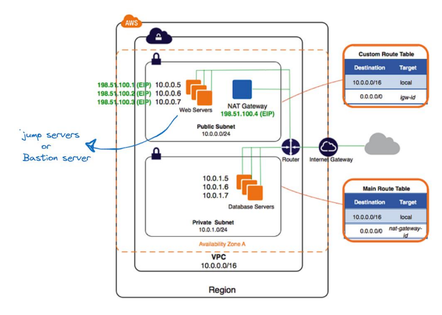

# AWS VPC Deployment Project

## Overview
This project provides a detailed implementation of an AWS Virtual Private Cloud (VPC) with a secure network architecture. The deployment process includes configuring public and private subnets, setting up a NAT gateway, and deploying a bastion server for secure SSH access to internal resources. The setup was recorded as a video, which is included in this repository.

## Architecture Details
The architecture follows AWS best practices for networking and security:
- **Virtual Private Cloud (VPC)**: Created with a CIDR block of `10.0.0.0/16`.
- **Public Subnet (`192.168.1.0/24`)**: Hosts web servers and a NAT Gateway.
- **Private Subnet (`192.168.2.0/24`)**: Houses database servers.
- **Bastion Host**: Placed in the public subnet for secure SSH access to private subnet instances.
- **Internet Gateway (IGW)**: Enables internet access for the public subnet.
- **NAT Gateway**: Allows outbound internet traffic from the private subnet.
- **Custom Route Tables**:
  - Public subnet routes traffic through the IGW.
  - Private subnet routes outbound traffic via the NAT Gateway.
- **Security Groups**:
  - Restricts SSH access to the Bastion Host.
  - Allows only necessary inbound and outbound traffic.

## Project Files
- `video.mp4`: Recorded step-by-step deployment process.
- `Screenshot-2025-03-27.png`: VPC network architecture diagram.
- `vpc-deployment.tf` (if applicable): Terraform script for automated provisioning.
- `README.md`: Documentation and setup instructions.

## Step-by-Step Deployment Guide
### 1. Create a VPC
- Define a VPC with CIDR `10.0.0.0/16`.
- Add subnets (`10.0.0.0/24` for public, `10.0.1.0/24` for private).
- Enable DNS hostnames and resolution for the VPC.

### 2. Configure Networking Components
- Attach an Internet Gateway to the VPC.
- Deploy a NAT Gateway in the public subnet and associate an Elastic IP.

### 3. Launch EC2 Instances
- Deploy a Bastion Host in the public subnet for SSH access.
- Launch web servers in the public subnet.
- Deploy database servers in the private subnet.

### 4. Configure Route Tables
- Public subnet route table directs external traffic via IGW.
- Private subnet route table routes outbound traffic through the NAT Gateway.

### 5. Set Up Security Groups & IAM Roles
- Allow SSH access only to the Bastion Host.
- Secure the database subnet by restricting inbound connections.
- Assign IAM roles for EC2 instances as needed.

## Deployment Video
[Watch the Full Deployment](https://drive.google.com/file/d/1eeOMBs2Jikvnr1dV8FLNc_STp9MIAbC3/view?usp=sharing)

## Conclusion
This project provides a hands-on demonstration of setting up a secure and scalable AWS VPC. The architecture ensures controlled access and best practices in cloud networking. Feel free to fork, modify, and expand upon this setup!
